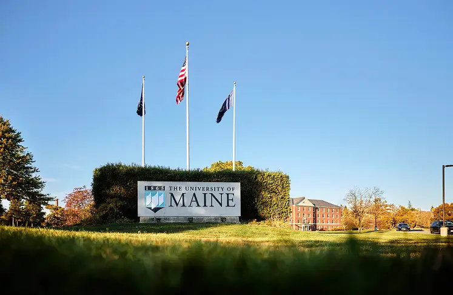

```{=html}
<div class="shell contact-page">

<header class="page-hero contact-hero">
  <div class="lighthouse-background" aria-hidden="true">
    <svg class="lighthouse-water" viewBox="0 0 1200 320" preserveAspectRatio="none" focusable="false">
      <defs><linearGradient id="lighthouse-water-wash" x1="0" y1="0" x2="0" y2="1"><stop stop-color="#e0e8e4"/><stop offset="1" stop-color="#e0e8e4" stop-opacity="0"/></linearGradient></defs>
      <path d="M0 245Q100 231 200 245T400 245T600 245T800 245T1000 245T1200 245V320H0Z" fill="url(#lighthouse-water-wash)"/>
      <g class="lighthouse-ripples" fill="none" stroke="#829892" stroke-width="1.5" opacity=".5"><path d="M-200 245Q-100 231 0 245T200 245T400 245T600 245T800 245T1000 245T1200 245T1400 245"/><path d="M-100 272Q0 258 100 272T300 272T500 272T700 272T900 272T1100 272T1300 272" opacity=".5"/></g>
    </svg>
    <svg class="lighthouse-scene" viewBox="0 0 360 300" focusable="false">
      <defs><linearGradient id="lighthouse-light" x1="0" y1="0" x2="1" y2="0"><stop stop-color="#b8cbc4" stop-opacity="0"/><stop offset="1" stop-color="#b8cbc4" stop-opacity=".45"/></linearGradient></defs>
      <path class="lighthouse-beam" d="M247 86 -1100 -30V190Z" fill="url(#lighthouse-light)"/>
      <g stroke="#829892" stroke-width="1.7" stroke-linejoin="round">
        <path d="M116 256 142 242 167 244 187 229 216 234 244 220 273 230 296 226 319 244 349 251 360 270H116Z" fill="#b8cbc4"/>
        <path d="m151 255 19-11 16 13m29-22 15 19 24-12m40-14-8 26 24 7" fill="none" opacity=".65"/>
        <path d="M225 111H270L281 234H214Z" fill="#e0e8e4"/>
        <path d="M222 154H274L276 172H220Z" fill="#b8cbc4"/>
        <path d="M218 112H278V104H218Z" fill="#b8cbc4"/>
        <path d="M231 104V73H264V104Z" fill="#faf9f6"/>
        <path d="M225 73 247 56 270 73Z" fill="#829892"/>
        <path d="M247 57V47 M242 77V100 M254 77V100" fill="none"/>
        <path d="M239 234V211Q247 200 255 211V234Z" fill="#829892"/>
        <path d="M243 129H252V143H243Z M242 185H251V197H242Z" fill="#faf9f6"/>
      </g>
    </svg>
  </div>
  <div class="contact-hero-copy"><h1>Let’s talk coast.</h1><p class="lead">Research questions, potential collaborations, or your next chapter in coastal science. Start a conversation with Dr. Huguenard.</p></div><div class="lighthouse-controls"><button class="lighthouse-toggle" type="button" aria-pressed="false" hidden>Pause animation</button></div></header>
<div class="section contact-grid">
  <div class="contact-aside" role="complementary" aria-labelledby="contact-name">
    <article class="contact-card">
      <figure class="contact-photo"><figcaption>University of Maine &middot; Orono</figcaption></figure>
      <div class="contact-card-body"><p class="eyebrow">Your point of contact</p><h2 id="contact-name">Dr. Kimberly<br>Huguenard</h2><p class="contact-role">Principal investigator, SWELL Lab</p><p class="contact-location">University of Maine <span aria-hidden="true">/</span> Orono, Maine</p><p id="recipient-display" class="email"><a href="mailto:kimberly.huguenard@maine.edu?cc=vanessa.mahan%40maine.edu">kimberly.huguenard@maine.edu</a></p><p id="recipient-note" class="form-help">Drafts are addressed to Kim with Vanessa Mahan copied.</p></div>
    </article>
    <div class="accessibility-card" id="accessibility-feedback"><p class="eyebrow">An open conversation</p><h3>Accessibility feedback</h3><p><a href="mailto:kimberly.huguenard@maine.edu?cc=vanessa.mahan%40maine.edu&amp;subject=SWELL%20Lab%20accessibility%20feedback">Email accessibility feedback</a> if you encounter a barrier using this site. Include the page and the task you were trying to complete.</p></div>
  </div>
  <section class="contact-form-panel" aria-labelledby="form-heading"><div class="correspondence-label eyebrow"><span>Coastal correspondence</span><span aria-hidden="true">↗</span></div><h2 id="form-heading">A Note to Dr. Huguenard</h2><p id="form-instructions" class="form-help">This form prepares a draft in your email application. You must send it yourself. Nothing is submitted or stored by this website. All fields are required.</p>
    <!-- Keep these recipients consistent with the visible email and accessibility links. -->
    <form id="contact-form" data-recipient="kimberly.huguenard@maine.edu" data-cc="vanessa.mahan@maine.edu" aria-describedby="form-instructions">
      <div class="field"><label for="sender-name">Your name</label><input id="sender-name" name="name" autocomplete="name" required maxlength="120" aria-describedby="name-error"><p id="name-error" class="field-error" hidden></p></div>
      <div class="field"><label for="sender-email">Your email</label><input id="sender-email" name="email" type="email" autocomplete="email" required maxlength="254" aria-describedby="email-error"><p id="email-error" class="field-error" hidden></p></div>
      <div class="field"><label for="subject">Subject</label><input id="subject" name="subject" required maxlength="160" aria-describedby="subject-error"><p id="subject-error" class="field-error" hidden></p></div>
      <div class="field"><label for="message">Message</label><textarea id="message" name="message" rows="7" required maxlength="5000" aria-describedby="message-error"></textarea><p id="message-error" class="field-error" hidden></p></div>
      <div class="actions"><button class="button" id="open-draft" type="submit" disabled aria-describedby="recipient-note">Open email draft <span aria-hidden="true">↗</span></button><button class="button secondary" id="prepare-message" type="button" disabled>Prepare message to copy</button></div>
      <p id="form-status" class="form-status" role="status" aria-live="polite" aria-atomic="true"></p>
      <noscript><p>Message preparation requires JavaScript. You can write your message directly in your email application using the email link above. Accessibility feedback can also be emailed using the link in the Accessibility feedback section.</p></noscript>
    </form>
    <div id="draft-preview" class="draft-preview" hidden><label for="copy-text">Your prepared message</label><p id="copy-help" class="form-help">If your email app does not open, copy this message into a new email. Nothing has been sent.</p><textarea id="copy-text" rows="10" readonly aria-describedby="copy-help"></textarea><div class="actions"><button class="button secondary" id="copy-message" type="button">Copy message</button></div><p id="copy-status" role="status" aria-live="polite"></p></div>
  </section>
</div>

</div>
```
