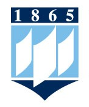
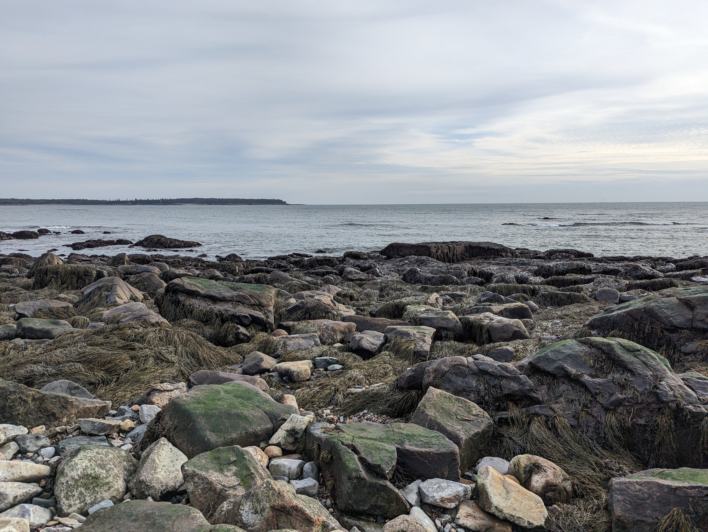
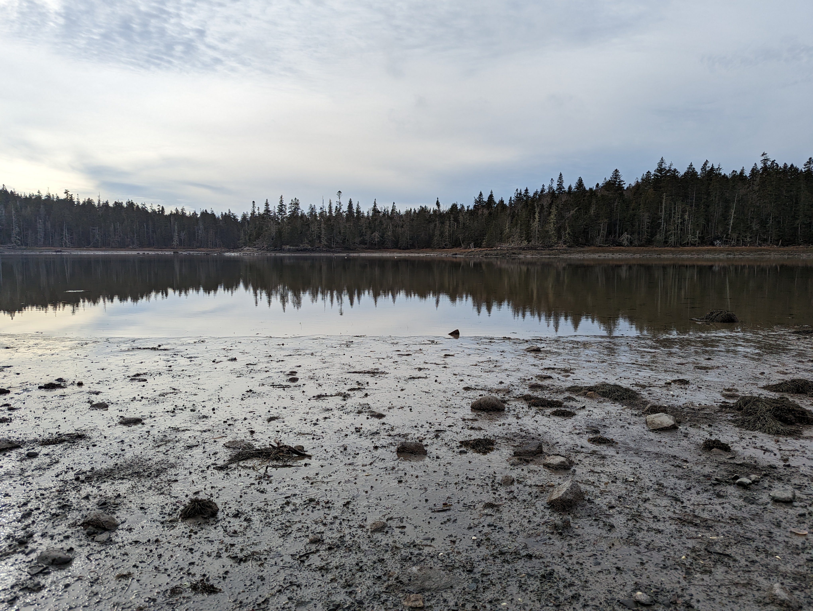
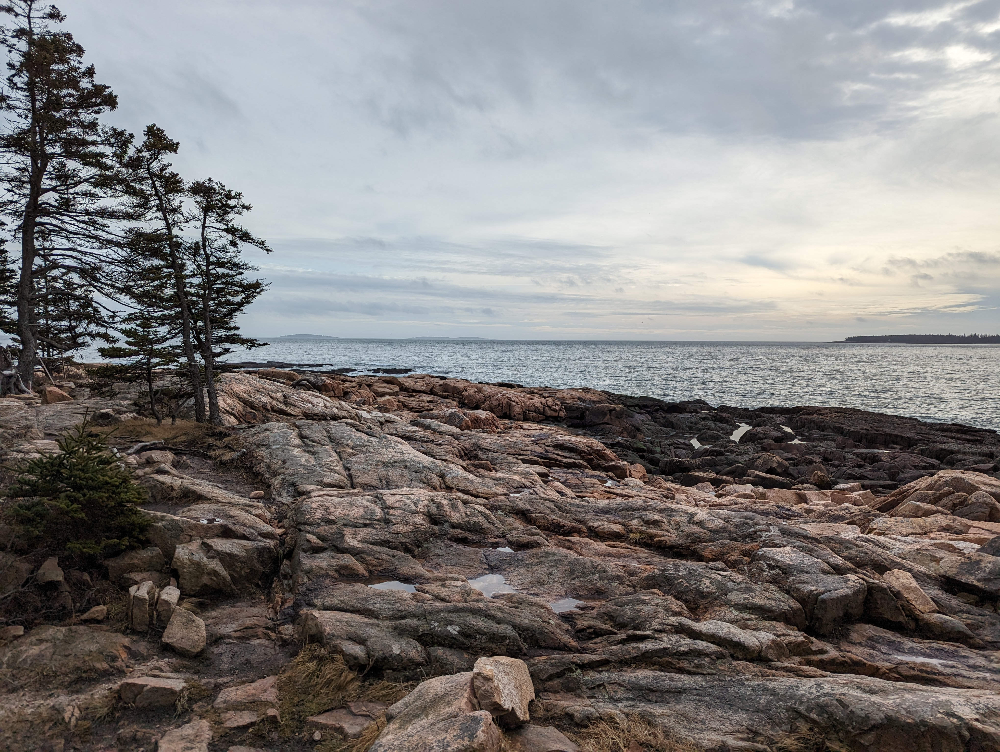

```{=html}
<div class="shell">

<section class="cover" aria-labelledby="cover-title">
  <div class="cover-meta">
    <span class="cover-university"><span>University of Maine</span></span>
    <span class="cover-focus"><span class="cover-focus-label">Research focus</span><span class="cover-focus-title">Coastal &amp; estuarine science</span></span>
  </div>
  <div class="masthead-scene">
    <svg class="masthead-wave" viewBox="0 0 1320 300" preserveAspectRatio="none" aria-hidden="true" focusable="false">
      <defs>
        <linearGradient id="wave-water" x1="0" y1="0" x2="0" y2="1">
          <stop offset="0" stop-color="#829892"/>
          <stop offset="1" stop-color="#e0e8e4" stop-opacity="0"/>
        </linearGradient>
      </defs>
      <path class="wave-wash" d="M0 262 C180 230 260 285 445 258 S720 236 900 263 S1170 240 1320 253 L1320 300 H0Z" fill="#e0e8e4"/>
      <g class="wave-surge">
        <path d="M-300 300 V267 C-50 273 150 257 295 212 C440 170 454 69 562 38 C641 15 733 38 759 94 C780 140 748 184 705 187 C735 162 735 126 708 106 C674 80 623 99 616 141 C602 230 768 252 936 245 C1090 239 1210 254 1430 273 V340 H-300Z" fill="url(#wave-water)"/>
        <g fill="none" stroke="#faf9f6" stroke-linecap="round">
          <path d="M170 263 C365 240 439 164 495 98 C552 30 678 23 730 82 C759 114 754 150 723 169" stroke-width="5"/>
          <path d="M281 270 C440 233 494 184 530 135 C557 98 586 79 620 74 M390 277 C483 250 548 207 565 164" stroke-width="2"/>
          <path d="M558 45 Q596 27 626 35 M644 37 Q684 39 706 58 M722 70 L734 86" stroke-width="9"/>
        </g>
      </g>
      <g class="wave-foam" fill="#b8cbc4">
        <path d="M425 272 Q456 240 488 261 Q514 220 547 252 Q577 229 606 263 Q640 229 677 260 Q708 247 733 270 Q785 246 829 277 Q965 269 1080 288 Q792 310 425 292Z"/>
        <circle cx="527" cy="213" r="5"/><circle cx="559" cy="191" r="3"/><circle cx="613" cy="220" r="6"/><circle cx="673" cy="205" r="4"/><circle cx="713" cy="236" r="3"/>
        <path d="M466 280 Q541 261 600 281 T752 281 T926 288" fill="none" stroke="#faf9f6" stroke-width="4" stroke-linecap="round"/>
      </g>
    </svg>
    <h1 class="masthead" id="cover-title">SWELL</h1>
  </div>
  <div class="wave-controls"><button class="wave-toggle" type="button" hidden>Pause waves</button></div>
  <p class="cover-subtitle">Storms, Waves, and Estuary Linkages Laboratory</p>
  <div class="intro-grid">
    <div><p class="eyebrow">At the water’s edge</p><h2>A changing coast.<br>A closer look.</h2><p class="lead">We study the forces that move water through our coasts and estuaries—from the everyday rhythm of tides to the extremes of coastal storms.</p><p>Led by Dr. Kimberly Huguenard at the University of Maine, our research connects observations of coastal processes with questions about resilience.</p><div class="actions"><a class="button" href="research.html">Explore our research <span aria-hidden="true">↗</span></a><a class="button secondary" href="people.html">Meet the people</a></div></div>
    <section class="landscape-carousel" aria-roledescription="carousel" aria-label="Coastal landscapes">
      <div class="landscape-window">
        <div class="landscape-track" aria-live="off">
          <div class="landscape-slide" role="group" aria-roledescription="slide" aria-label="1 of 3"></div>
          <div class="landscape-slide" role="group" aria-roledescription="slide" aria-label="2 of 3" aria-hidden="true"></div>
          <div class="landscape-slide" role="group" aria-roledescription="slide" aria-label="3 of 3" aria-hidden="true"></div>
        </div>
        <p class="landscape-caption">The coast is our common ground.</p>
      </div>
      <div class="landscape-controls" hidden>
        <button class="slide-playback" type="button">Pause slideshow</button>
        <div class="slide-navigation"><button class="slide-previous" type="button" aria-label="Previous photograph">←</button><span class="slide-count" aria-live="off">1 / 3</span><button class="slide-next" type="button" aria-label="Next photograph">→</button></div>
      </div>
    </section>
  </div>
</section>
<section class="section" aria-labelledby="research-heading">
  <div class="section-heading"><h2 id="research-heading">Where water meets questions.</h2><a href="research.html">Our research themes <span aria-hidden="true">↗</span></a></div>
  <div class="research-grid">
    <article class="research-card">
      <div class="research-card-mark"><span class="number" aria-hidden="true">01</span>
        <svg class="research-icon" viewBox="0 0 64 64" aria-hidden="true" focusable="false">
          <path class="research-icon-wash" d="M8 44 Q16 38 24 44 T40 44 T56 44 V55 H8Z"/>
          <path d="M16 29a8 8 0 0 1 0-16 12 12 0 0 1 23-3 9 9 0 1 1 7 19H35"/>
          <path d="m28 25-6 10h9l-6 10 M13 34l-3 5 M45 34l-3 5 M54 34l-3 5"/>
          <path d="M8 47q8-6 16 0t16 0 16 0 M8 55q8-6 16 0t16 0 16 0"/>
        </svg>
      </div>
      <h3>Storms &amp; coastal flooding</h3><p>Understanding how storms, tides, and river flows shape coastal water levels.</p>
    </article>
    <article class="research-card">
      <div class="research-card-mark"><span class="number" aria-hidden="true">02</span>
        <svg class="research-icon" viewBox="0 0 64 64" aria-hidden="true" focusable="false">
          <path d="M7 9h15v12c0 12-6 19-15 21Z M57 9H42v12c0 12 6 19 15 21Z" fill="currentColor" fill-opacity=".08" stroke="none"/>
          <path d="M22 9v12c0 12-6 19-15 21 M42 9v12c0 12 6 19 15 21"/>
          <path d="M27 18v21m-4-4 4 4 4-4 M37 39V18m-4 4 4-4 4 4"/>
          <path d="M8 48q8-5 16 0t16 0 16 0 M8 56q8-5 16 0t16 0 16 0"/>
        </svg>
      </div>
      <h3>Estuaries in motion</h3><p>Investigating circulation, turbulence, and mixing where rivers meet the sea.</p>
    </article>
    <article class="research-card">
      <div class="research-card-mark"><span class="number" aria-hidden="true">03</span>
        <svg class="research-icon" viewBox="0 0 64 64" aria-hidden="true" focusable="false">
          <path d="M57 29H44c-6 0-9 4-12 11s-8 13-14 15h39Z" fill="currentColor" fill-opacity=".08" stroke="none"/>
          <path d="M57 29H44c-6 0-9 4-12 11 M18 55h39"/>
          <path d="M43 29V13 M43 24q-1-8-7-10 M43 22q2-9 7-12 M53 29V19m0 6q3-6 6-7"/>
          <path d="M30 43c-4-5-9-1-8 3l7 1 1-4Z M39 38c-4-4-9 0-8 4l8 1Z M20 49c-4-4-9 0-8 4l8 1Z"/>
          <path d="M7 26h9c5 0 6-7 2-7-3 0-4 3-2 4 M7 35q4-3 8 0t8 0 M7 43q4-3 8 0"/>
        </svg>
      </div>
      <h3>Resilient coastlines</h3><p>Connecting coastal processes with living shorelines, aquaculture, and marine renewable energy.</p>
    </article>
  </div>
</section>
<section class="section" aria-labelledby="people-heading">

  <figure><div class="photo-placeholder group-placeholder"><span class="placeholder-mark" aria-hidden="true">SW</span><span>Group photograph forthcoming</span></div><figcaption>Space reserved for a photograph supplied by the lab.</figcaption></figure>
  <div class="team-intro"><h2 id="people-heading">Different perspectives.<br>Shared curiosity.</h2><div><p class="lead">One principal investigator, one postdoctoral researcher, three PhD students, and one master’s student. Get to know the people behind SWELL.</p><a href="people.html">Meet our team <span aria-hidden="true">↗</span></a></div></div>
</section>
<section class="section join-strip" aria-labelledby="join-heading"><div><h2 id="join-heading">Curious about the coast?</h2><p>Start a conversation about research at SWELL.</p></div><a class="button" href="positions.html">Explore opportunities <span aria-hidden="true">↗</span></a></section>

</div>
```
