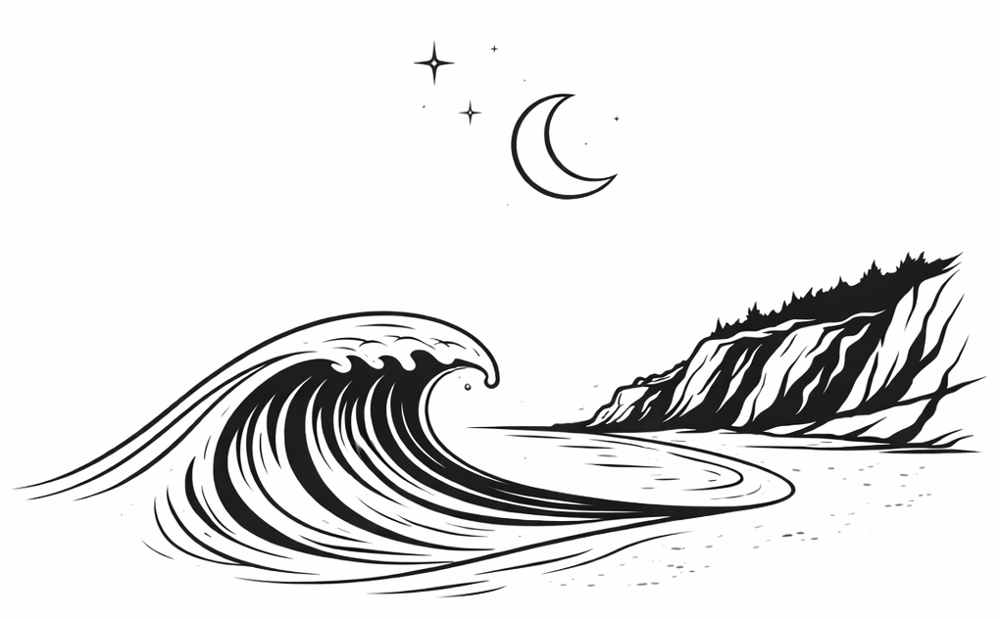

<!-- PASSWORD GATE -->

  

    
    ✦ ─── ✦ ─── ✦
    <h2>Lab Members Only</h2>
    
This area contains internal resources for current SWELL Lab members — meeting notes, field protocols, data access, computing guides, and lab policies.

    ✦ ─── ✦ ─── ✦
    <input type="password" id="sw-pw" class="sw-input" placeholder="Enter lab password" autocomplete="off" style="text-align:center;letter-spacing:0.2em;margin-top:1rem;">
    
Incorrect password — please try again.

    <button onclick="swCheckPw()" class="sw-btn sw-btn-dark" style="width:100%;margin-top:0.75rem;">Enter</button>
    
Forgot the password? Contact the PI or lab manager.

  

<!-- MEMBERS CONTENT — shown after correct password -->

  

    Internal · Members Only
    <h1>Lab Members Area</h1>
    
Internal resources for current SWELL Lab researchers.

  

  

    <h4>Field Protocols</h4>
    

      <a href="#">Field Safety Protocol (PDF)</a> 
      <a href="#">ADCP Deployment Guide</a> 
      <a href="#">Sediment Core Procedures</a> 
      <a href="#">Lab Boat Training</a> 
      <a href="#">Chemical Handling SOP</a>
    

  

  

    <h4>Data & Computing</h4>
    

      <a href="#">Lab Server Access Guide</a> 
      <a href="#">HPC Cluster Quickstart</a> 
      <a href="#">Shared Data Folder</a> 
      <a href="#">Model Configuration Templates</a> 
      <a href="#">GitHub Organization ↗</a>
    

  

  

    <h4>Lab Policies</h4>
    

      <a href="#">Lab Handbook (PDF)</a> 
      <a href="#">Authorship Policy</a> 
      <a href="#">Travel & Reimbursement</a> 
      <a href="#">Annual Review Template</a> 
      <a href="#">DEI Statement</a>
    

  

✦ &nbsp; ✦ &nbsp; ✦

  Internal Schedule
  <h2>Meeting Calendar</h2>

<table class="sw-table">
<thead>
<tr><th>Meeting</th><th>When</th><th>Where</th></tr>
</thead>
<tbody>
<tr><td>Lab Group Meeting</td><td>Tuesdays, 10:00–11:30 am</td><td>[Room] / Zoom</td></tr>
<tr><td>One-on-Ones (PI)</td><td>By appointment</td><td>PI Office</td></tr>
<tr><td>Journal Club</td><td>Fridays, 12:00–1:00 pm (bi-weekly)</td><td>[Room]</td></tr>
<tr><td>Field Planning</td><td>As needed</td><td>Slack #field-logistics</td></tr>
</tbody>
</table>

✦ &nbsp; ✦ &nbsp; ✦

  In Progress
  <h2>Manuscripts in Preparation</h2>

<table class="sw-table">
<thead>
<tr><th>Working Title</th><th>Lead Author</th><th>Target Journal</th><th>Status</th></tr>
</thead>
<tbody>
<tr><td>[Title]</td><td>[Name]</td><td>JGR-Oceans</td><td>In revision</td></tr>
<tr><td>[Title]</td><td>[Name]</td><td>Estuaries & Coasts</td><td>In preparation</td></tr>
<tr><td>[Title]</td><td>PI</td><td>Nature Geoscience</td><td>In preparation</td></tr>
</tbody>
</table>

