```{=html}
<div class="shell news-page">
  <header class="news-masthead">
    <div class="bottle-background" aria-hidden="true">
    <svg class="bottle-sea" viewBox="0 0 360 240" preserveAspectRatio="none" focusable="false">
      <defs><linearGradient id="bottle-water" x1="0" y1="0" x2="0" y2="1"><stop stop-color="#e0e8e4"/><stop offset="1" stop-color="#e0e8e4" stop-opacity="0"/></linearGradient></defs>
      <path d="M0 153Q45 141 90 153T180 153T270 153T360 153V230H0Z" fill="url(#bottle-water)"/>
      <g class="bottle-ripples" fill="none" stroke="#829892" stroke-width="1.4" stroke-linecap="round" opacity=".6">
        <path d="M-90 158Q-45 146 0 158T90 158T180 158T270 158T360 158T450 158"/>
        <path d="M50 178q35-8 70 0 M220 184q35-8 70 0" opacity=".5"/>
      </g>
    </svg>
    <svg class="bottle-vessel" viewBox="0 0 360 240" focusable="false">
      <g class="bottle-drift">
        <g class="bottle-float" stroke="#829892" stroke-width="1.8" stroke-linejoin="round">
          <path d="M105 85H210Q235 85 245 105H278V135H245Q235 155 210 155H105Q85 155 85 135V105Q85 85 105 85Z" fill="#e0e8e4" fill-opacity=".7"/>
          <path d="M112 98H210V142H112Q104 138 108 132V106Q104 100 112 98Z" fill="#faf9f6"/>
          <path d="M112 98Q121 104 112 110 M112 133Q121 139 112 142" fill="none" stroke-width="1"/>
          <text x="161" y="127" text-anchor="middle" fill="#304f50" stroke="none" font-family="Georgia, serif" font-size="23" letter-spacing="2">NEWS</text>
          <path d="M277 108H292V132H277Z" fill="#b8cbc4"/>
          <path d="M270 103V137 M98 117V106Q98 95 111 95H207 M98 127V135" fill="none" stroke="#faf9f6" stroke-width="3" stroke-linecap="round"/>
        </g>
      </g>
    </svg>
    </div>

    <h1>The SWELL Edit</h1>

    <div class="bottle-controls"><button class="bottle-toggle" type="button" aria-pressed="false" hidden>Pause animation</button></div>
  </header>
  <p class="news-preview-note">Latest from SWELL &middot; Research and profile highlights accompany our lab news. Campus, coastal, and fieldwork scenes illustrate story themes; event photographs are identified in their captions.</p>
  <section class="news-front" aria-label="Featured lab highlights">
    <article class="news-story news-feature">
      <a href="#kennebec-fieldwork">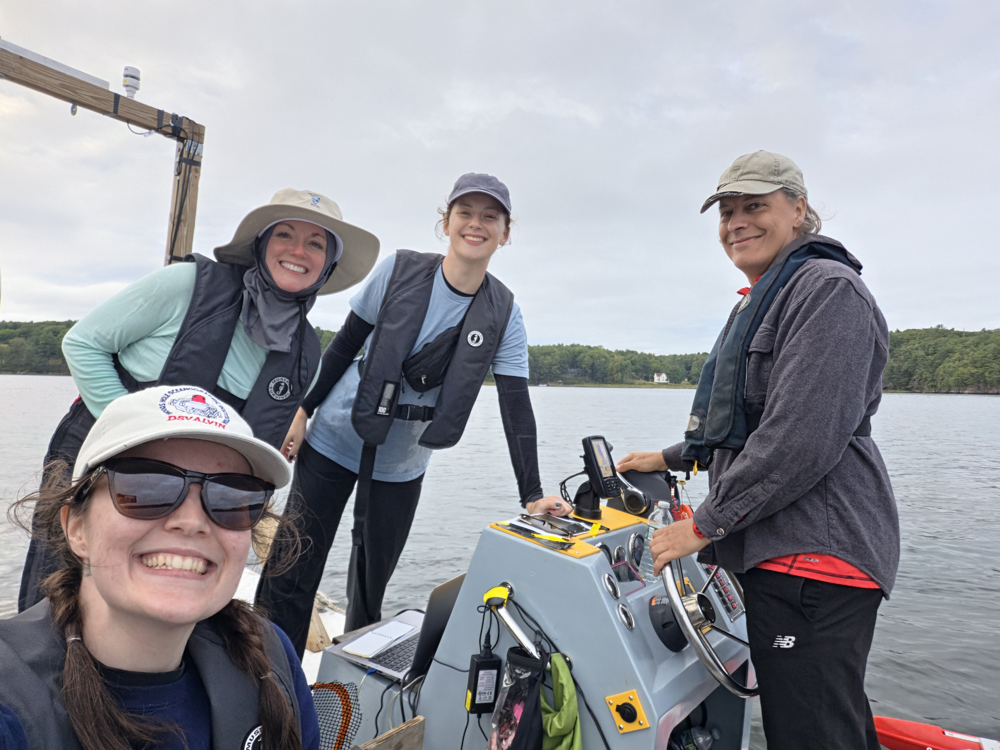<p class="news-category">From the field</p><h2>Kennebec River, Maine field work</h2><p class="news-credit"><time datetime="2026-09-07">September 7, 2026</time> &middot; SWELL Lab</p></a>
      <p class="news-image-note">The field team aboard the boat. <a href="research.html#activities">Explore our research activities and fieldwork photos.</a></p>
    </article>
    <div class="news-side">
      <article class="news-story"><a href="#pecs-2026">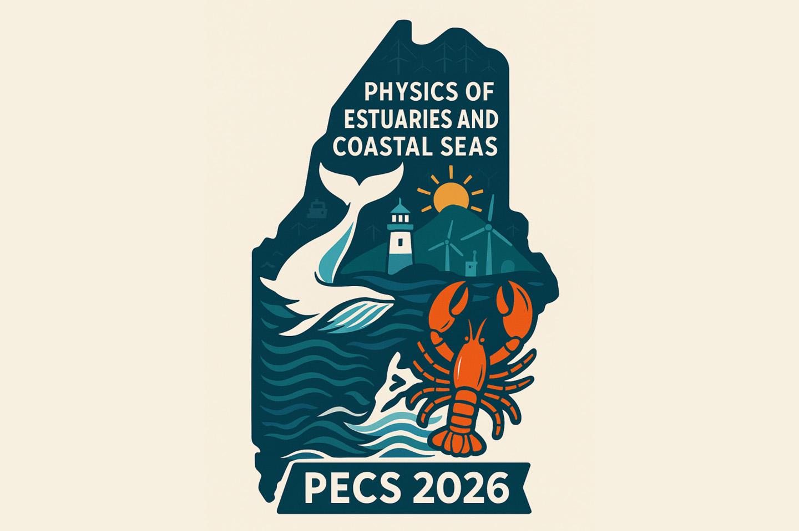<p class="news-category">Conferences</p><h2>SWELL helps bring PECS 2026 to Portland, Maine</h2><p class="news-credit"><time datetime="2026-08-09">August 9</time>&ndash;<time datetime="2026-08-14">14, 2026</time></p></a></article>
      <article class="news-story"><a href="#vanessa-defense">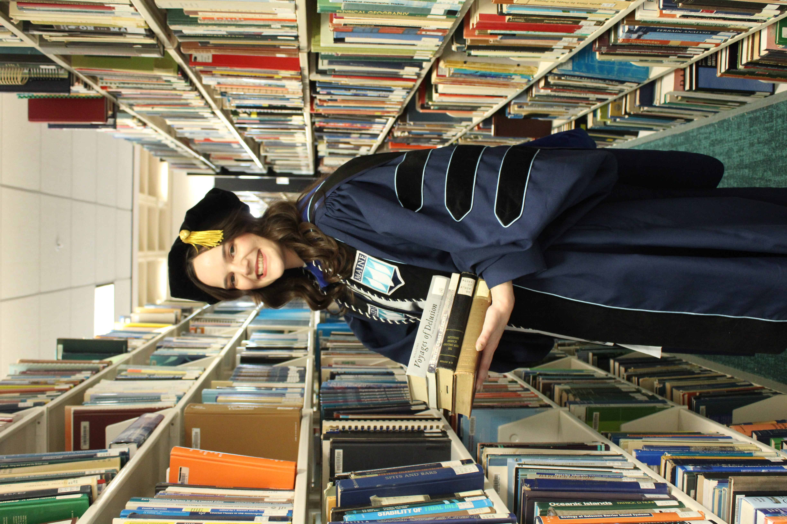<p class="news-category">Lab milestones</p><h2>Vanessa's Defense</h2><p class="news-credit"><time datetime="2026-04-17">April 17, 2026</time></p></a></article>
    </div>
    <section class="news-briefs" aria-labelledby="in-focus-title">
      <h2 id="in-focus-title" class="news-section-label">In focus</h2>
      <article class="news-brief"><a href="people.html#nalika-name"><div><p class="news-category">Research perspectives</p><h3>Tides, storm surges, and the nearshore coast</h3><p class="news-credit">Nalika Lakmali</p></div>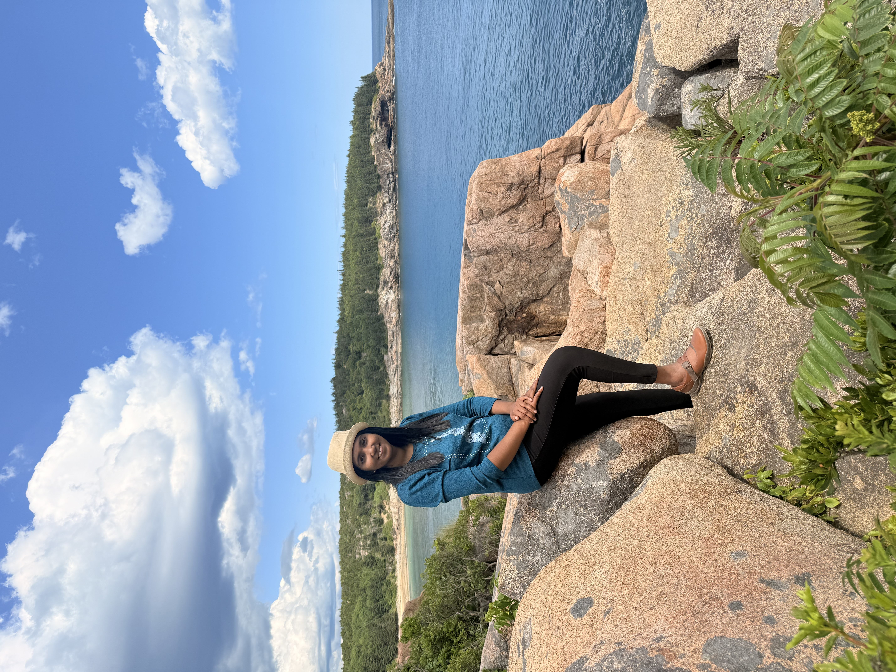</a></article>
      <article class="news-brief"><a href="people.html#malavika-name"><div><p class="news-category">Coastal dynamics</p><h3>A closer look at waves and water levels</h3><p class="news-credit">Malavika Sudhakaran</p></div>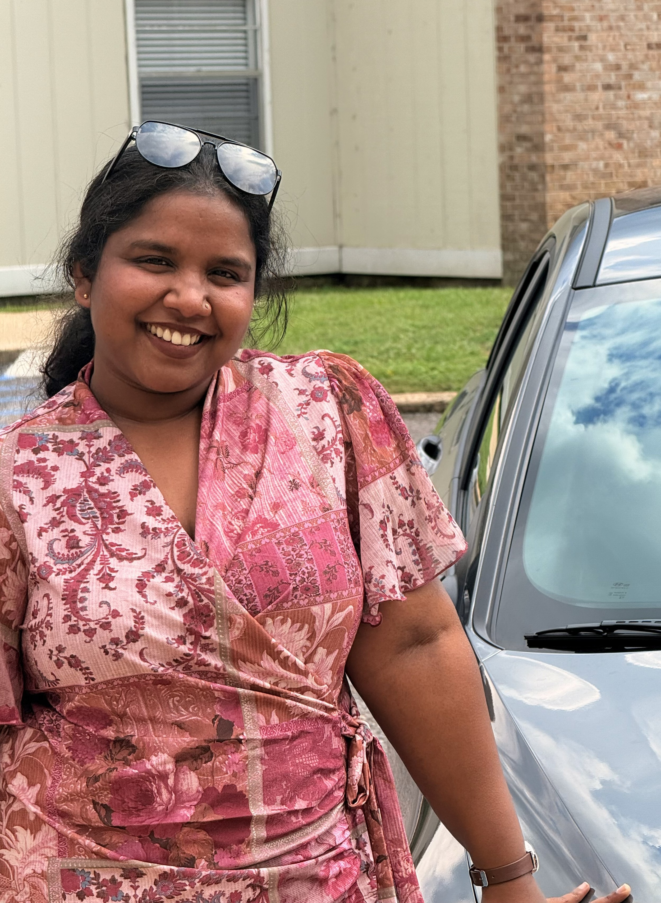</a></article>
      <article class="news-brief"><a href="#welcome-sasha"><div><p class="news-category">New student</p><h3>Welcome to SWELL, Sasha Bugbee!</h3><p class="news-credit">From Washington State to Maine</p></div>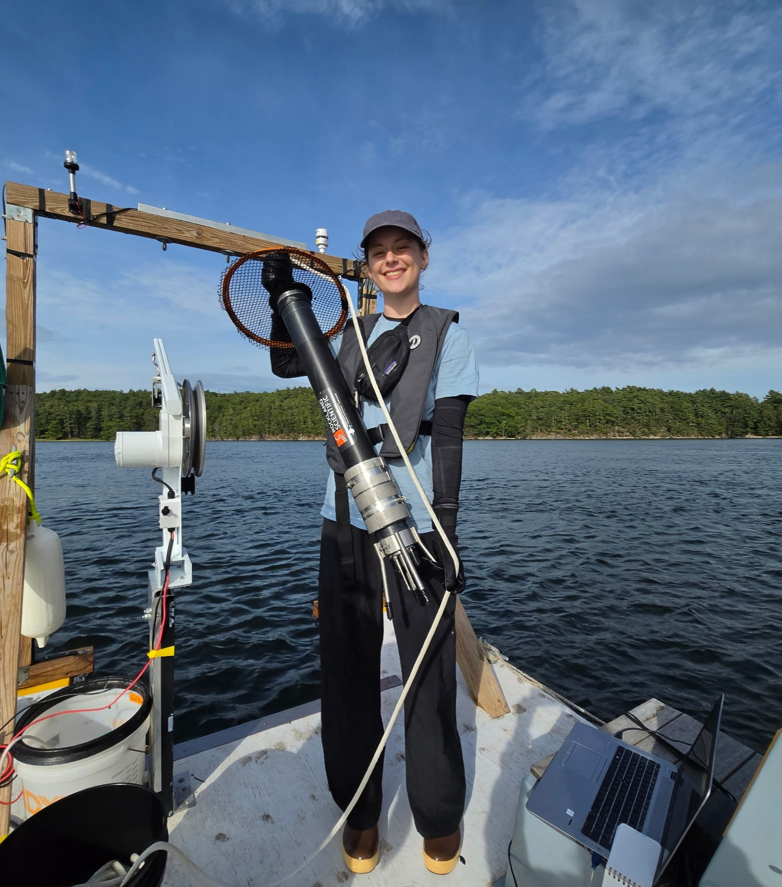</a></article>
      <article class="news-brief"><a href="positions.html"><div><p class="news-category">Lab life</p><h3>Bring your curiosity to coastal science</h3><p class="news-credit">Explore opportunities</p></div></a></article>
    </section>
  </section>
  <article class="news-dispatch" id="kennebec-fieldwork" aria-labelledby="kennebec-title">
    <p class="news-category">Field notes &middot; <time datetime="2026-09-07">September 7, 2026</time></p>
    <h2 id="kennebec-title">Kennebec River, Maine field work</h2>
    <figure class="news-photo">
      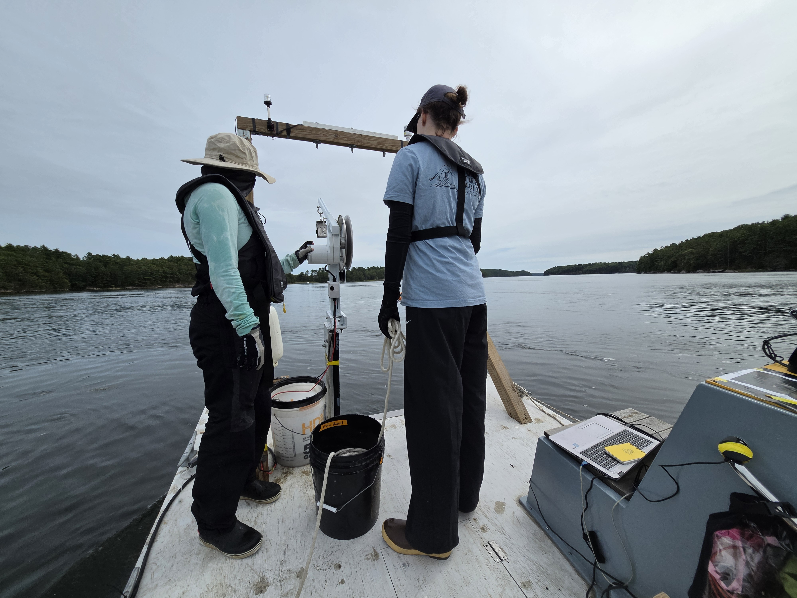
      <figcaption>Kennebec River, Maine &middot; September 7, 2026</figcaption>
    </figure>
    <p class="lead">Fieldwork on the Kennebec River, Maine.</p>
    <p>A recap of the fieldwork will be added here.</p>
    <!-- Add the lab's supplied account of activities, participants, instruments, and observations here. -->
  </article>
  <section class="news-archive" aria-labelledby="previous-news-title">
    <h2 id="previous-news-title" class="news-section-label">Previous News</h2>
    <p class="news-archive-note">Stories and milestones from the lab, alongside research highlights.</p>
    <div class="news-archive-grid">
      <article class="news-story"><a href="#pecs-2026">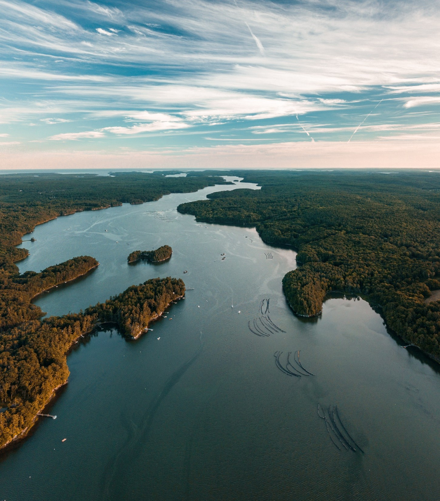<p class="news-category">Conferences</p><h3>22nd Physics of Estuaries and Coastal Seas</h3><p class="news-credit"><time datetime="2026-08-09">August 9</time>&ndash;<time datetime="2026-08-14">14, 2026</time> &middot; Portland, Maine</p></a></article>
      <article class="news-story"><a href="#welcome-sasha"><p class="news-category">New student</p><h3>Welcome to SWELL, Sasha Bugbee!</h3><p class="news-credit">From Washington State to Maine</p></a></article>
      <article class="news-story"><a href="#vanessa-defense">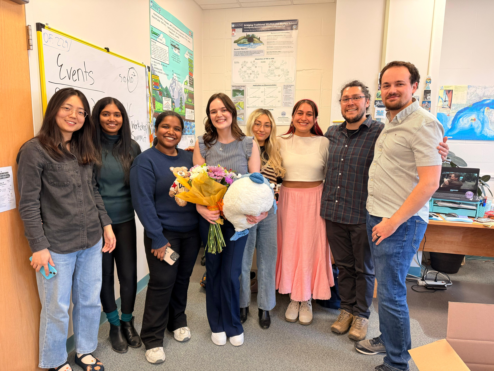<p class="news-category">Lab milestones</p><h3>Vanessa's Defense</h3><p class="news-credit"><time datetime="2026-04-17">April 17, 2026</time></p></a></article>
      <article class="news-story"><a href="people.html#malavika-name">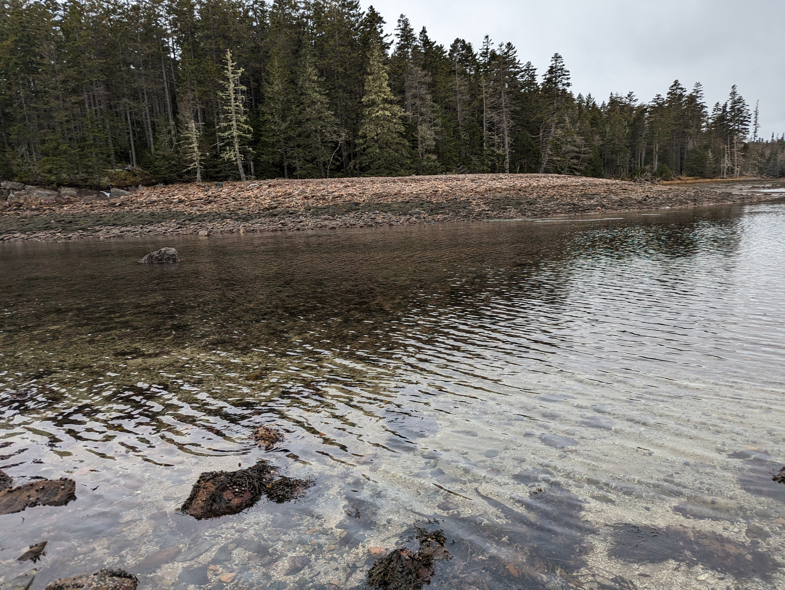<p class="news-category">From the field</p><h3>Monitoring waves and currents along the Maine coast</h3><p class="news-credit">Researcher profile</p></a></article>
    </div>
  </section>
  <article class="news-dispatch" id="pecs-2026" aria-labelledby="pecs-title">
    <p class="news-category">Conferences &middot; <time datetime="2026-08-09">August 9</time>&ndash;<time datetime="2026-08-14">14, 2026</time></p>
    <h2 id="pecs-title">22nd Physics of Estuaries and Coastal Seas (PECS 2026)</h2>
    <figure class="news-photo">
      <div class="photo-placeholder news-photo-placeholder"><span class="placeholder-mark" aria-hidden="true">SW</span><span>PECS 2026 conference photo forthcoming</span></div>
      <figcaption>Portland, Maine &middot; August 9&ndash;14, 2026</figcaption>
    </figure>
    <p class="lead">Kimberly Huguenard helped facilitate PECS 2026, with SWELL Lab members helping run the conference in Portland, Maine.</p>
    <p>The conference took place from Sunday, August 9, through Friday, August 14, 2026, at Hannaford Hall at the University of Southern Maine. PECS brings coastal engineers and oceanographers together to exchange research on estuaries and coastal seas, with opportunities for students and early-career researchers to connect with the wider community.</p>
    <p>Topics included tides and waves, sediment transport, river&ndash;coast interactions, and estuaries under climate change.</p>
    <p><a href="https://umaine.edu/mcec/outreach/pecs-2026/">Visit the official PECS 2026 conference page</a> for the program and further details.</p>
    <!-- Conference logo source: https://umaine.edu/mcec/wp-content/uploads/sites/1131/2026/03/pecs2026logo.jpg -->
  </article>
  <article class="news-dispatch" id="vanessa-defense" aria-labelledby="vanessa-defense-title">
    <p class="news-category">Lab milestones &middot; <time datetime="2026-04-17">April 17, 2026</time></p>
    <h2 id="vanessa-defense-title">Vanessa's Defense</h2>
    <figure class="news-photo">
      
      <figcaption>Vanessa's Defense &middot; April 17, 2026</figcaption>
    </figure>
    <p class="lead">Vanessa Mahan Quintana's defense took place on April 17, 2026.</p>
    <p>More details from the day will be added here.</p>
    <p><a href="people.html#vanessa-name">Meet Vanessa</a></p>
    <!-- Add the supplied defense title, recap, and event photographs here. -->
  </article>
  <article class="news-dispatch" id="welcome-sasha" aria-labelledby="welcome-sasha-title">
    <p class="news-category">New student &middot; SWELL Lab</p>
    <h2 id="welcome-sasha-title">Welcome to SWELL, Sasha Bugbee!</h2>
    <figure class="news-photo">
      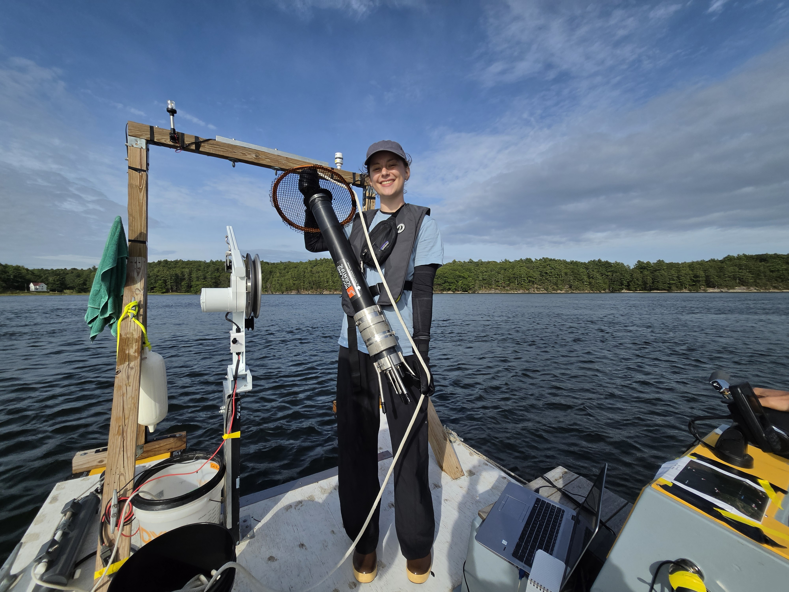
      <figcaption>Welcoming Sasha Bugbee to SWELL Lab.</figcaption>
    </figure>
    <p class="lead">Sasha Bugbee joins SWELL Lab as a new student from Washington State. Welcome to Maine, Sasha!</p>
    <p>We are excited to welcome Sasha to the team and look forward to the research ahead.</p>
    <p><a href="people.html#sasha-name">Meet Sasha and learn about her research</a></p>
    <!-- Add the confirmed joining date and welcome photograph when supplied. -->
  </article>
</div>
```
