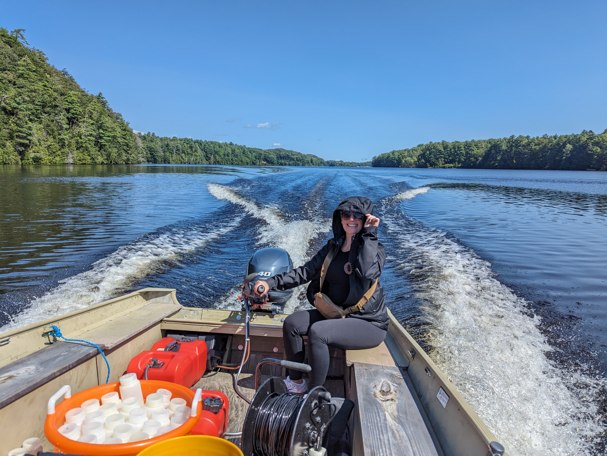
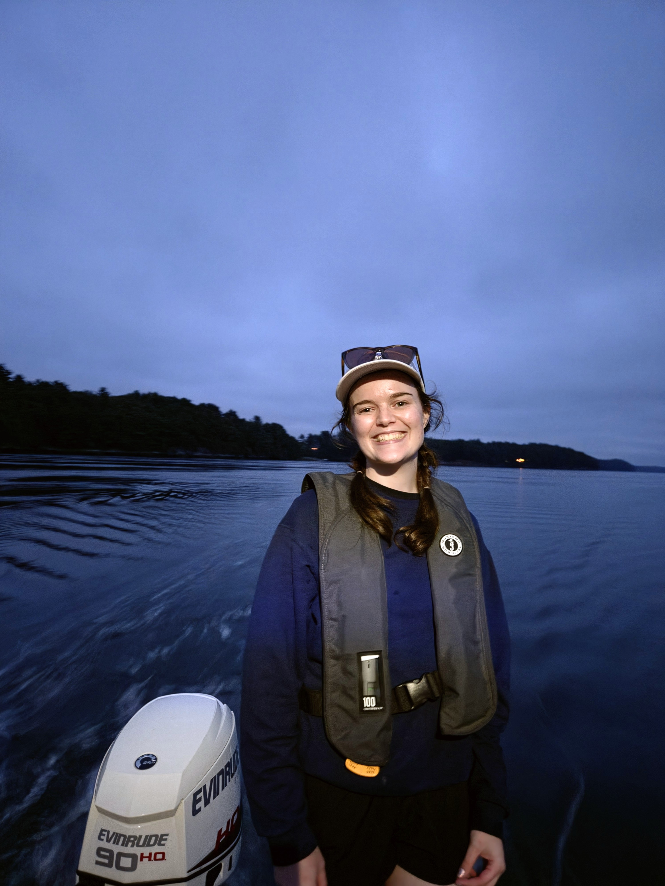
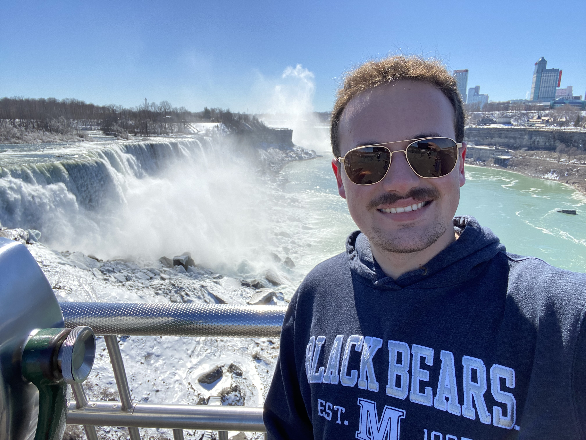

```{=html}
<div class="shell">

<header class="page-hero people-hero">
  <svg class="adcp-background" viewBox="0 0 600 420" aria-hidden="true" focusable="false">
    <defs>
      <linearGradient id="adcp-water" x1="0" y1="0" x2="0" y2="1"><stop stop-color="#e0e8e4" stop-opacity=".4"/><stop offset="1" stop-color="#e0e8e4" stop-opacity=".08"/></linearGradient>
      <clipPath id="adcp-water-clip"><path d="M-1800 104 Q-1725 88 -1650 104 T-1500 104 T-1350 104 T-1200 104 T-1050 104 T-900 104 T-750 104 T-600 104 T-450 104 T-300 104 T-150 104 T0 104 T150 104 T300 104 T450 104 T600 104 T750 104 T900 104 V400 H-1800Z"/></clipPath>
    </defs>
    <g clip-path="url(#adcp-water-clip)">
      <rect x="-1800" y="80" width="2700" height="310" fill="url(#adcp-water)"/>
      <g class="adcp-current" fill="none" stroke="#829892" stroke-width="1.5" stroke-linecap="round" opacity=".65">
        <path d="M-1770 162h65m-9-6 9 6-9 6 M-1560 162h65m-9-6 9 6-9 6 M-1350 162h65m-9-6 9 6-9 6 M-1140 162h65m-9-6 9 6-9 6 M-930 162h65m-9-6 9 6-9 6 M-720 162h65m-9-6 9 6-9 6 M-510 162h65m-9-6 9 6-9 6 M-300 162h65m-9-6 9 6-9 6 M720 162h65m-9-6 9 6-9 6 M-1730 260h45m-9-6 9 6-9 6 M-1520 260h45m-9-6 9 6-9 6 M-1310 260h45m-9-6 9 6-9 6 M-1100 260h45m-9-6 9 6-9 6 M-890 260h45m-9-6 9 6-9 6 M-680 260h45m-9-6 9 6-9 6 M-470 260h45m-9-6 9 6-9 6 M-260 260h45m-9-6 9 6-9 6 M770 260h45m-9-6 9 6-9 6"/>
        <path d="M-90 162h65m-9-6 9 6-9 6 M90 162h65m-9-6 9 6-9 6 M300 162h65m-9-6 9 6-9 6 M510 162h65m-9-6 9 6-9 6 M-50 260h45m-9-6 9 6-9 6 M140 260h45m-9-6 9 6-9 6 M380 260h45m-9-6 9 6-9 6 M560 260h45m-9-6 9 6-9 6"/>
      </g>
      <g fill="none" stroke="#567a74">
        <path d="M323 343 233 125 M337 343 427 125 M328 343 298 125 M332 343 362 125" opacity=".15"/>
        <path class="adcp-beams" d="M323 343 233 125 M337 343 427 125 M328 343 298 125 M332 343 362 125" stroke-width="2" stroke-dasharray="5 25" opacity=".5"/>
      </g>
    </g>
    <path class="adcp-surface" d="M-1800 104 Q-1725 88 -1650 104 T-1500 104 T-1350 104 T-1200 104 T-1050 104 T-900 104 T-750 104 T-600 104 T-450 104 T-300 104 T-150 104 T0 104 T150 104 T300 104 T450 104 T600 104 T750 104 T900 104" fill="none" stroke="#829892" stroke-width="2"/>
    <g class="adcp-mooring" fill="none" stroke="#829892" stroke-width="1.5"><path d="M475 108 C482 210 465 302 460 377"/></g>
    <g class="adcp-buoy" stroke="#567a74" stroke-width="2" stroke-linejoin="round">
      <path d="M475 88V49 M475 50l20 7-20 7" fill="#b8cbc4"/>
      <path d="M461 88l7-17h14l7 17" fill="#e0e8e4"/>
      <path d="M449 91 Q475 80 501 91 L494 109 Q475 116 456 109Z" fill="#b8cbc4"/>
      <path d="M452 98h46" fill="none"/>
    </g>
    <path d="M-1800 388 Q-1700 375 -1590 386 T-1380 383 T-1170 388 T-960 386 T-750 383 T-540 388 T-330 386 T-120 383 T0 388 Q100 375 210 386 T420 383 T600 388 T810 386 T900 383" fill="none" stroke="#829892" stroke-width="1.5"/>
    <g class="adcp-bed-chain" fill="none" stroke-linecap="round" stroke-dasharray="6 2">
      <path d="M356 380 Q400 389 451 380" stroke="#567a74" stroke-width="3.5"/>
      <path d="M356 380 Q400 389 451 380" stroke="#e0e8e4" stroke-width="1"/>
    </g>
    <g stroke="#567a74" stroke-width="2" stroke-linejoin="round">
      <path d="M304 382 317 353h26l15 29 M314 382h35" fill="none"/>
      <path d="M316 343h28v22h-28Z" fill="#b8cbc4"/>
      <ellipse cx="330" cy="343" rx="14" ry="5" fill="#e0e8e4"/>
      <path d="M322 341h4m8 0h4 M326 345h7" stroke-width="3"/>
      <path d="M449 383l5-9h14l5 9Z" fill="#b8cbc4"/>
    </g>
  </svg>
  <div class="people-hero-copy"><h1>The minds behind<br>the measurements.</h1><p class="lead">Meet the researchers of SWELL Lab.</p></div>
  <div class="adcp-controls"><button class="adcp-toggle" type="button" aria-pressed="false" hidden>Pause animation</button></div>
</header>
<p class="review-note">Team directory in preparation. Remaining portraits and research biographies will be supplied by the lab.</p>
<section class="section profile-feature" aria-labelledby="kim-name">
  
  <div><p class="eyebrow">Principal investigator</p><h2 id="kim-name">Dr. Kimberly<br>Huguenard</h2><p>SWELL Lab · University of Maine</p><p class="pending">Research biography forthcoming.</p><p class="email"><a href="mailto:kimberly.huguenard@maine.edu">kimberly.huguenard@maine.edu</a></p><a href="contact.html">Contact Dr. Huguenard <span aria-hidden="true">↗</span></a></div>
</section>
<section class="section" aria-labelledby="researchers-heading"><p class="eyebrow">The team</p><h2 id="researchers-heading">Our researchers.</h2>
  <div class="profile-grid">
    <article aria-labelledby="vanessa-name"><p class="role">Postdoctoral researcher</p><h3 id="vanessa-name">Dr. Vanessa Mahan Quintana</h3><p>Dr. Vanessa Mahan Quintana is a postdoctoral researcher in the Department of Civil and Environmental Engineering at the University of Maine. Her research integrates field observations, hydrodynamics, and individual-based modeling to understand how interacting physical, biological, and behavioral processes shape ecological patterns and environmental risk.</p><p>Her work focuses particularly on contaminant fate and exposure in aquatic and estuarine systems, including mercury and PFAS, and on developing reusable ecological modeling approaches for research and decision support.</p><p>She earned her Ph.D. in Marine Biology from the University of Maine in 2026 under the guidance of Dr. Kimberly Huguenard in the School of Marine Sciences.</p><p class="email"><a href="mailto:vanessa.mahan@maine.edu">vanessa.mahan@maine.edu</a></p></article>
    <article aria-labelledby="nalika-name"><p class="role">PhD Candidate in Civil Engineering, University of Maine</p><h3 id="nalika-name">Nalika Lakmali</h3><p>Nalika Lakmali is a researcher with interests in estuarine tidal hydrodynamics, tide-surge interactions, and numerical modelling of nearshore coastal processes. She earned her bachelor’s degree in Earth Resources Engineering and her master’s degree in water resources engineering and management from the University of Moratuwa, Sri Lanka. Her research aims to inform and support the sustainable management of global coastal and inland water resources (<a href="https://scholar.google.com/citations?user=ITeYz_EAAAAJ&amp;hl=en">Google Scholar</a>, <a href="https://www.linkedin.com/in/nalika-lakmali-5ab3a480/">LinkedIn</a>).</p><p class="email"><a href="mailto:engiliyage.nalika.lakmali@maine.edu">engiliyage.nalika.lakmali@maine.edu</a></p></article>
    <article aria-labelledby="nicolas-name"><p class="role">PhD student</p><h3 id="nicolas-name">Nicolas Cyr</h3><p>Nick Cyr is a coastal engineering researcher specializing in cold-region estuarine hydrodynamics and large-scale observational field studies.</p><p>His doctoral research examines physical processes in estuarine systems using measurements of currents, waves, salinity, density, and internal wave and current phenomena, with particular experience in the Penobscot River and Bay.</p><p>He completed his M.E. and B.S. degrees in Civil and Environmental Engineering, focusing on water resources and coastal engineering, and expects to complete his PhD in 2027.</p><p class="email"><a href="mailto:nicolas.cyr@maine.edu">nicolas.cyr@maine.edu</a></p></article>
    <article aria-labelledby="malavika-name"><p class="role">PhD student</p><h3 id="malavika-name">Malavika Sudhakaran, PhD Researcher in Civil and Environmental Engineering</h3><p>Malavika Sudhakaran is a Ph.D. Researcher in Civil and Environmental Engineering at the University of Maine. Her research focuses on coastal hydrodynamics, particularly nonlinear wave-tide-surge interactions and their influence on water levels and coastal circulation. She uses the hydrodynamic model, Delft3D to investigate coastal processes and storm-driven dynamics at the Kennebec coast and is also involved in field monitoring of waves, currents, and water levels at living shoreline sites along the Maine coast. She earned her master’s degree in physical Oceanography from Cochin University of Science and Technology, India, in 2019.</p><p class="email"><a href="mailto:malavika.sudhakaran@maine.edu">malavika.sudhakaran@maine.edu</a></p></article>
    <article aria-labelledby="sasha-name"><p class="role">Master’s student</p><h3 id="sasha-name">Sasha Bugbee, M.S. Civil Engineering</h3><p>Sasha Bugbee is a graduate student pursuing her M.S. in Civil Engineering at the University of Maine. Her research focuses on using observational turbulence data to understand the hydrodynamics of the Kennebec River Estuary. Prior to graduate school, she was an undergraduate research assistant at the University of Washington, where she instrumented the Willapa River Estuary to examine coastal flooding response and provide data for local stakeholders. She earned her B.S. in Civil Engineering there, with an emphasis in riverine and coastal engineering.</p><p class="email"><a href="mailto:sasha.bugbee@maine.edu">sasha.bugbee@maine.edu</a></p></article>
  </div>
</section>
<section class="section join-strip" aria-labelledby="team-join"><div><h2 id="team-join">Make waves with us.</h2><p>Interested in becoming part of the lab?</p></div><a class="button" href="positions.html">Explore opportunities <span aria-hidden="true">↗</span></a></section>

</div>
```
