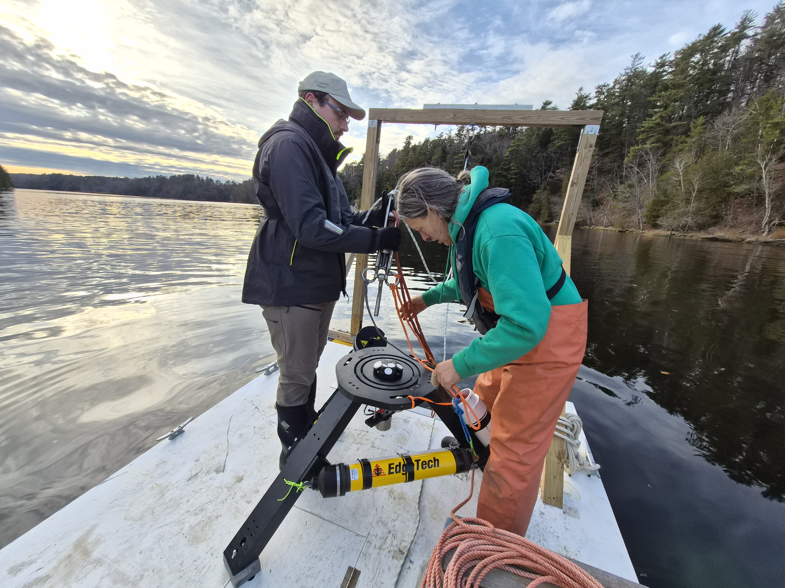
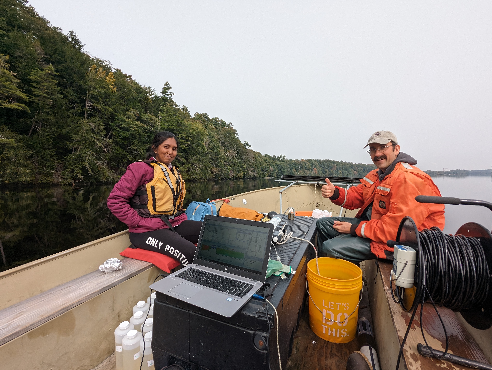
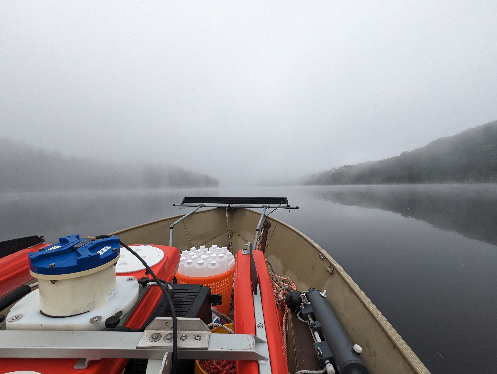
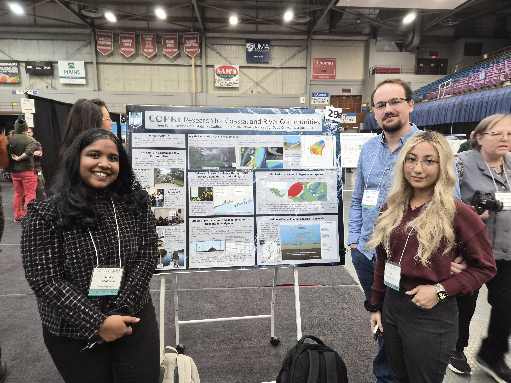

```{=html}
<div class="shell research-page">

<header class="page-hero research-hero">
<svg class="tidal-background" viewBox="0 0 1320 400" preserveAspectRatio="none" aria-hidden="true" focusable="false">
  <defs>
    <linearGradient id="tidal-fade"><stop stop-color="white" stop-opacity=".06"/><stop offset=".5" stop-color="white" stop-opacity=".2"/><stop offset="1" stop-color="white" stop-opacity=".85"/></linearGradient>
    <mask id="tidal-mask"><rect width="1320" height="400" fill="url(#tidal-fade)"/></mask>
  </defs>
  <g mask="url(#tidal-mask)">
    <path d="M0 140 C290 115 490 185 720 130 S1050 125 1320 35 L1320 365 C1050 275 960 320 720 270 S290 285 0 260Z" fill="#e0e8e4"/>
    <g fill="none" stroke="#829892" stroke-width="1.5">
      <path d="M0 140 C290 115 490 185 720 130 S1050 125 1320 35 M0 260 C290 285 490 215 720 270 S1050 275 1320 365"/>
      <path d="M0 119 C290 94 490 164 720 109 S1050 104 1320 14 M0 281 C290 306 490 236 720 291 S1050 296 1320 386" opacity=".4"/>
      <path d="M0 185 Q330 166 660 182 T1320 140 M0 215 Q330 234 660 218 T1320 260" stroke-dasharray="3 12" opacity=".55"/>
    </g>
    <g class="tidal-flood" fill="none" stroke="#567a74" stroke-width="3" stroke-linecap="round" stroke-linejoin="round">
      <path d="M230 200h-76m15-11-15 11 15 11 M450 200h-76m15-11-15 11 15 11 M670 200h-76m15-11-15 11 15 11 M890 200h-76m15-11-15 11 15 11 M1110 200h-76m15-11-15 11 15 11 M1330 200h-76m15-11-15 11 15 11"/>
    </g>
    <g class="tidal-ebb" fill="none" stroke="#567a74" stroke-width="3" stroke-linecap="round" stroke-linejoin="round">
      <path d="M70 200h76m-15-11 15 11-15 11 M290 200h76m-15-11 15 11-15 11 M510 200h76m-15-11 15 11-15 11 M730 200h76m-15-11 15 11-15 11 M950 200h76m-15-11 15 11-15 11 M1170 200h76m-15-11 15 11-15 11"/>
    </g>
  </g>
</svg>
<div class="research-hero-copy"><h1>Reading the coast.</h1><p class="lead">From individual currents to coastal systems, we investigate how water moves—and what that movement means for a changing shoreline.</p><nav class="research-jump" aria-label="Research themes"><a href="#storms">Flooding <span aria-hidden="true">↘</span></a><a href="#estuaries">Estuaries <span aria-hidden="true">↘</span></a><a href="#resilience">Resilience <span aria-hidden="true">↘</span></a><a href="#activities">Research activities <span aria-hidden="true">↘</span></a></nav></div><div class="tidal-controls">
  <span class="tidal-static-label">Flood: inland ← · Ebb: seaward → · Slack: still water</span>
  <button class="tidal-toggle" type="button" aria-pressed="false" hidden>Pause tides</button>
</div>
</header>
<p class="review-note">Research overview: draft for lab review.</p>
<section class="research-row" aria-labelledby="storms"><div class="research-mark"><span class="number" aria-hidden="true">01</span><svg class="research-icon" viewBox="0 0 64 64" aria-hidden="true" focusable="false">
          <path class="research-icon-wash" d="M8 44 Q16 38 24 44 T40 44 T56 44 V55 H8Z"/>
          <path d="M16 29a8 8 0 0 1 0-16 12 12 0 0 1 23-3 9 9 0 1 1 7 19H35"/>
          <path d="m28 25-6 10h9l-6 10 M13 34l-3 5 M45 34l-3 5 M54 34l-3 5"/>
          <path d="M8 47q8-6 16 0t16 0 16 0 M8 55q8-6 16 0t16 0 16 0"/>
        </svg></div><h2 id="storms">Storms &amp;<br>coastal flooding</h2><div class="research-detail"><p>Storm surge, tides, and river flows interact to influence coastal flooding. We investigate these connections to better understand how extreme events affect estuaries and nearby communities.</p><ul class="research-tags" aria-label="Topics"><li>Storm surge</li><li>Tides</li><li>Compound flooding</li></ul><p class="research-question"><span class="eyebrow">The driving question</span>When do storms, tides, and rivers combine to raise water levels?</p></div></section>
<section class="research-row" aria-labelledby="estuaries"><div class="research-mark"><span class="number" aria-hidden="true">02</span><svg class="research-icon" viewBox="0 0 64 64" aria-hidden="true" focusable="false">
          <path d="M7 9h15v12c0 12-6 19-15 21Z M57 9H42v12c0 12 6 19 15 21Z" fill="currentColor" fill-opacity=".08" stroke="none"/>
          <path d="M22 9v12c0 12-6 19-15 21 M42 9v12c0 12 6 19 15 21"/>
          <path d="M27 18v21m-4-4 4 4 4-4 M37 39V18m-4 4 4-4 4 4"/>
          <path d="M8 48q8-5 16 0t16 0 16 0 M8 56q8-5 16 0t16 0 16 0"/>
        </svg></div><h2 id="estuaries">Estuaries<br>in motion</h2><div class="research-detail"><p>Where rivers meet the ocean, circulation and mixing shape the water’s structure. Field observations help us investigate turbulence, river plumes, and the exchange of fresh and salt water.</p><ul class="research-tags" aria-label="Topics"><li>Circulation</li><li>Turbulence</li><li>Mixing</li></ul><p class="research-question"><span class="eyebrow">The driving question</span>How do fresh and salt water move, mix, and exchange?</p></div></section>
<section class="research-row" aria-labelledby="resilience"><div class="research-mark"><span class="number" aria-hidden="true">03</span><svg class="research-icon" viewBox="0 0 64 64" aria-hidden="true" focusable="false">
          <path d="M57 29H44c-6 0-9 4-12 11s-8 13-14 15h39Z" fill="currentColor" fill-opacity=".08" stroke="none"/>
          <path d="M57 29H44c-6 0-9 4-12 11 M18 55h39"/>
          <path d="M43 29V13 M43 24q-1-8-7-10 M43 22q2-9 7-12 M53 29V19m0 6q3-6 6-7"/>
          <path d="M30 43c-4-5-9-1-8 3l7 1 1-4Z M39 38c-4-4-9 0-8 4l8 1Z M20 49c-4-4-9 0-8 4l8 1Z"/>
          <path d="M7 26h9c5 0 6-7 2-7-3 0-4 3-2 4 M7 35q4-3 8 0t8 0 M7 43q4-3 8 0"/>
        </svg></div><h2 id="resilience">Resilient<br>coastlines</h2><div class="research-detail"><p>Coastal science also informs practical decisions. Our broader research interests connect hydrodynamics with living shorelines, aquaculture systems, and marine renewable energy.</p><ul class="research-tags" aria-label="Topics"><li>Living shorelines</li><li>Aquaculture</li><li>Offshore wind</li></ul><p class="research-question"><span class="eyebrow">The driving question</span>How can understanding coastal processes inform coastal decisions?</p></div></section>
<section class="section research-activities" aria-labelledby="activities">
  <header class="activities-heading"><p class="eyebrow">Research in practice</p><h2 id="activities">On the water. In the lab. Together.</h2><p class="lead">Our research connects field measurements, sample analysis, and shared learning. Here is how we collect observations and bring coastal science into conversation.</p></header>
  <div class="activities-grid">
    <article class="activity-card">
      <figure><figcaption>Preparing an instrument frame on the water.</figcaption></figure>
      <div class="activity-copy"><p class="eyebrow">Measure currents</p><h3>ADCP deployments &amp; data processing</h3><p>We deploy acoustic Doppler current profilers (ADCPs) and process the observations to investigate currents and estuarine circulation.</p></div>
    </article>
    <article class="activity-card">
      <figure><figcaption>Working with instruments and a laptop aboard the field boat.</figcaption></figure>
      <div class="activity-copy"><p class="eyebrow">Across the estuary</p><h3>ADCP transecting</h3><p>Boat-based transects let us observe how conditions vary across an estuary. Transecting complements our instrument deployments and connects measurements from different parts of the system.</p></div>
    </article>
    <article class="activity-card">
      <figure><figcaption>Handling a sampling line from the field boat.</figcaption></figure>
      <div class="activity-copy"><p class="eyebrow">Through the water column</p><h3>microCTD &amp; Eureka probe casts</h3><p>Our field activities include microCTD casts and Eureka probe casting. These observations complement current measurements as we study conditions through the water column.</p></div>
    </article>
    <article class="activity-card">
      <figure><figcaption>Sampling supplies ready for a day on the river.</figcaption></figure>
      <div class="activity-copy"><p class="eyebrow">From field to lab</p><h3>Sediment &amp; PFAS sampling</h3><p>We collect water samples containing suspended sediment using Niskin bottles, process sediment samples in the lab for organic and inorganic components, and carry out PFAS sampling.</p><ul class="activity-methods"><li>Suspended-sediment sampling with Niskin bottles</li><li>Laboratory processing of organic and inorganic sediment</li><li>PFAS sampling</li></ul></div>
    </article>
    <article class="activity-card">
      <figure><figcaption>A space prepared for presentations and discussion.</figcaption></figure>
      <div class="activity-copy"><p class="eyebrow">Exchange methods</p><h3>Workshop facilitation</h3><p>We facilitate workshops that bring people together to discuss coastal research, exchange methods, and learn from one another.</p></div>
    </article>
    <article class="activity-card">
      <figure><figcaption>Sharing coastal research at the Maine Sustainability &amp; Water Conference in Augusta, March 26, 2026.</figcaption></figure>
      <div class="activity-copy"><p class="eyebrow">Share the science</p><h3>Conference participation</h3><p>We shared coastal research at the <a href="https://umaine.edu/mitchellcenter/2026-maine-sustainability-water-conference/">2026 Maine Sustainability &amp; Water Conference</a>, held at the Augusta Civic Center on March 26. Poster sessions, presentations, and discussion connect our work with the wider research community. We also participate in the Physics of Estuaries and Coastal Seas (PECS) conference.</p><p><a href="news.html#pecs-2026">Read about SWELL at PECS 2026 <span aria-hidden="true">↗</span></a></p></div>
    </article>
  </div>
</section>
<section class="section approach-card" aria-labelledby="approach-heading"><p class="eyebrow">The approach</p><h2 id="approach-heading">Observe. Understand. Connect.</h2><p class="lead">Field measurements provide a close look at coastal processes. Working across disciplines helps connect those observations to questions facing coastal communities.</p><p class="muted">The research themes above draw on <a href="https://umaine.edu/directory/ums_directory/kimberly-huguenard/">Dr. Huguenard’s University of Maine research profile</a>. The activities highlight our work in the field, in the lab, and with the research community.</p><div class="actions"><a class="button secondary" href="contact.html">Discuss a collaboration <span aria-hidden="true">↗</span></a></div></section>

</div>
```
